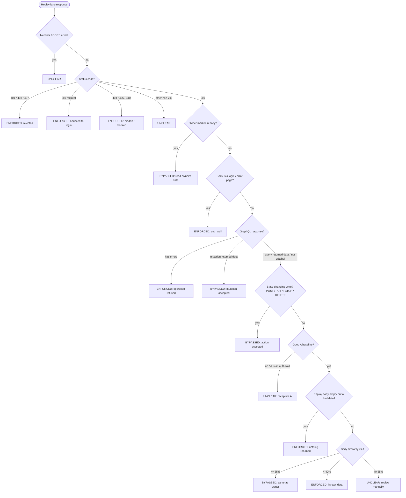

# AuthZ Replayer

An in-browser **access-control tester** for finding broken object-level (IDOR /
BOLA) and function-level (BFLA / privilege-escalation) authorization bugs -
without firing up Burp Suite + Autorize.


> **For authorized security testing only.** Only use this against systems you
> own or are explicitly authorized to test. Replaying *write* requests performs
> the action for real (create / modify / delete / email / charge). A one-time
> notice enforces this on first run.

## Table of contents

- [The core loop](#the-core-loop)
- [Install (load unpacked)](#install-load-unpacked)
- [Usage walkthrough](#usage-walkthrough)
- [How detection works](#how-detection-works)
  - [The three lanes](#the-three-lanes)
  - [Classification flow](#classification-flow)
  - [The classification rules in order](#the-classification-rules-in-order)
  - [GraphQL and RPC-over-POST](#graphql-and-rpc-over-post)
  - [Why status code alone is not enough](#why-status-code-alone-is-not-enough)
- [Verdicts](#verdicts)
- [Owner markers (the strongest signal)](#owner-markers-the-strongest-signal)
- [CSRF token auto-substitution](#csrf-token-auto-substitution)
- [Sequence replay (multi-step flows)](#sequence-replay-multi-step-flows)
- [Re-classifying after a settings change](#re-classifying-after-a-settings-change)
- [Exporting findings](#exporting-findings)
- [Settings](#settings)
- [Under the hood](#under-the-hood)
- [Edge cases & caveats](#edge-cases--caveats)
- [Project layout](#project-layout)
- [Non-goals](#non-goals)

## The core loop

1. Capture the session for two identities - **A** = resource owner / higher-priv,
   **B** = attacker / lower-priv.
2. Browse the target normally **as A**.
3. For each in-scope request, the extension silently replays it as **B** and as
   an **unauthenticated** client, keeping A's resource identifiers and swapping
   *only the session*.
4. It compares the responses, classifies each as **ENFORCED / BYPASSED /
   UNCLEAR**, and surfaces findings live with full request/response detail,
   a body diff, and **copy as cURL / fetch**.

Detection only starts once **two or more** identities are captured - with a
single identity there is nothing to test against.

## Install (load unpacked)

1. `chrome://extensions` -> enable **Developer mode**.
2. **Load unpacked** -> select this folder (the one with `manifest.json`).
3. Pin the extension and click its icon to open the **side panel** on the right.

## Usage walkthrough

1. **Capture A** - log into the target as the resource owner. Open the side panel
   (or use the on-page banner) and click **+ Capture**. It snapshots cookies
   (incl. HttpOnly), the `Authorization`/custom auth headers it has seen, and any
   configured `localStorage`/`sessionStorage` token keys. The captured origin is
   auto-added to scope. This identity becomes **A (browsing)**. Capturing again
   with the same credentials refreshes the existing identity instead of adding a
   duplicate.
2. **Switch user (safe)** - click **Switch user**. This clears the origin's
   cookies, localStorage, sessionStorage, **IndexedDB, service workers, and cache**
   **locally only** - it never calls `/logout`, so A's server-side session stays
   valid. (Clearing only cookies often leaves you logged in because apps like
   Firebase Auth keep the token in IndexedDB; this wipes those too.) The tab
   reloads to a fresh login page.
3. **Capture B** - log in as the second account and **+ Capture** again. It
   becomes **B (replay)** automatically (or click **->B** on any identity).
4. **Browse as A** - `GET`/`HEAD` requests in scope auto-replay as B and
   unauthenticated. For `POST`/`PUT`/`PATCH`/`DELETE`, a row is queued with a
   manual **Replay** button (with a destructive-action warning).
5. **(Recommended) Set owner markers** - open Settings and paste a few values
   that are unique to A (email, user id, an order number). See
   [Owner markers](#owner-markers-the-strongest-signal).
6. **Read findings** - click a row to expand the three lanes (Original A / Replay B
   / Unauthenticated). Each lane shows the full request + response with line
   numbers (Burp-style), a git-style diff vs the owner's response, the verdict +
   reasoning, and **copy as cURL / fetch**. Use the override buttons to re-label
   after manual inspection.

## How detection works

### The three lanes

Every in-scope request is run through up to three lanes so the responses can be
compared apples-to-apples. Only the session is swapped; the method, URL, query,
body, and content-type are kept identical.

| Lane | Identity | Purpose |
| --- | --- | --- |
| **Original (A)** | browsing identity | the trusted baseline - what the owner legitimately sees |
| **Replay (B)** | replay identity | does a lower-priv user get the owner's data / action? (IDOR / BOLA / BFLA) |
| **Unauthenticated** | no credentials | does *anyone* get it with no session at all? (most severe) |

### Classification flow

Each lane is classified independently against the Original (A) baseline. The
rules are evaluated top to bottom and the **first** match wins:



### The classification rules in order

1. **Status short-circuits.** `401/403/407`, any `3xx` redirect, and
   `404/405/410` are **ENFORCED** - the server actively refused or hid the
   resource for this identity.
2. **Owner-marker hit.** If a value you tagged as belonging to A (email, id,
   private string) appears verbatim in the replay body, it is **BYPASSED**
   regardless of similarity. This is the most reliable IDOR signal.
3. **Auth-wall body.** A `2xx` whose body is actually a login form or contains
   phrases like "forbidden / unauthorized / please log in / session expired" is
   **ENFORCED** (catches apps that return `200` instead of `403`).
4. **GraphQL result.** GraphQL replies `200` even on failure, so the verdict is
   read from the body: a non-empty `errors` array is **ENFORCED** (refused); a
   mutation that returned `data` is **BYPASSED**; a query that returned `data`
   falls through to the body comparison below. See
   [GraphQL and RPC-over-POST](#graphql-and-rpc-over-post).
5. **Write-method success.** A `2xx` on a REST `POST`/`PUT`/`PATCH`/`DELETE` is
   **BYPASSED** - the state-changing action was accepted as B even if the
   response body differs from A's (BFLA / privilege escalation).
6. **Baseline guard.** If there is no successful A baseline, or A's own baseline
   looks like a login/error page (A's session likely expired), the result is
   **UNCLEAR** with a "recapture and retry" hint instead of a false positive.
7. **Empty-body.** A `2xx` (or `204`) with an empty body while A received data is
   **ENFORCED**; if both are empty it is **UNCLEAR**.
8. **Body similarity.** For reads with a good baseline, similarity to A's body is
   computed - **JSON-structural** (flattened `path=value` leaf comparison,
   ignoring volatile keys) when both bodies are JSON, otherwise a token-Jaccard +
   length blend. `>= 85%` is **BYPASSED**, `< 40%` is **ENFORCED**, in between is
   **UNCLEAR**.

### GraphQL and RPC-over-POST

A GraphQL *query* is a read sent as a `POST`, so the naive "every POST mutates
state" rule would both refuse to auto-replay it and flag any `2xx` as BYPASSED on
method alone. The engine inspects the request body: only an operation containing
a `mutation` counts as a write (queued for manual replay); a `query` or
`subscription` is treated as a read and auto-replayed like a `GET`. Requests are
recognized as GraphQL by a `/graphql` (or `/gql`) path or a JSON body with a
`query` string. Because GraphQL returns `200` even on authorization failure, the
classifier reads the response body's `errors`/`data` shape rather than trusting
the status.

### Why status code alone is not enough

A "profile" or "current user" endpoint returns `200` for everyone with *their
own* data, and some apps return `200` with an error body instead of `403`. So
classification compares **response bodies**, not just status. Before diffing,
volatile fields (timestamps, request IDs, CSRF/nonces, UUIDs) are stripped via an
editable regex list so they do not cause spurious diffs.

## Verdicts

| Verdict | Meaning |
| --- | --- |
| **BYPASSED** (red) | The other identity read the owner's data, an owner marker leaked, or a write was accepted -> broken access control. Unauthenticated success is the most severe. |
| **ENFORCED** (green) | Replay `401/403`, redirect to login, `404`/blocked, an auth-wall body, an empty body, or clearly different data (its own). |
| **UNCLEAR** (yellow) | `2xx` with ambiguous similarity, no successful baseline, or an expired A baseline -> review manually and override. |

The toolbar badge shows the count of BYPASSED findings. Every per-finding
verdict can be overridden after manual inspection.

## Owner markers (the strongest signal)

Owner markers are **opt-in**. Open **Settings**, fill in the **Owner markers**
box (one value per line) with anything that is unique to A and should never
appear in B's or an unauthenticated response:

```
alice@example.com
user_id_4815
ORD-2024-99812
```

If any marker shows up verbatim in the Replay (B) or Unauthenticated lane, that
finding is flagged **BYPASSED** immediately (rule 2 above), even when the overall
body similarity is low. Leave the box empty and the rule simply does not fire.
Markers shorter than 3 characters are ignored to avoid noise.

## CSRF token auto-substitution

When a request carries a CSRF token in a header, replaying it as B with *A's*
token gets rejected (`403`) - a false ENFORCED that hides the real bug. So on
replay the engine rewrites any configured CSRF header to the replay identity's
**own** token:

- It first looks for a double-submit CSRF **cookie** (e.g. `XSRF-TOKEN`,
  `csrftoken`) in that identity and uses its value (URL-decoded).
- Failing that, it uses a CSRF **header** value captured for that identity.
- The unauthenticated lane has no token, so the CSRF header is dropped entirely.

The header names are configurable in Settings (defaults cover Angular, Django,
Rails, and ASP.NET conventions). Clear the list to disable the behavior. Tokens
carried in the request **body** (e.g. Rails `authenticity_token`) are not
auto-substituted yet - edit B's identity or use sequence replay for those.

## Sequence replay (multi-step flows)

Each request is normally replayed in isolation, which breaks flows that depend on
a previous step (grab a token in step 1, use it in step 2; add to cart then
checkout). To handle these, tick the checkbox on each finding you want to chain,
then click **Replay as sequence**. The selected requests run in capture order,
and each lane (A / B / unauthenticated) keeps its **own cookie jar that
accumulates `Set-Cookie` across steps** - so a session or CSRF cookie set by an
early step is carried into the later ones. Writes in the selection prompt for
confirmation first.

## Re-classifying after a settings change

Verdicts are computed from the captured responses, so changing detection inputs
(owner markers, volatile-field patterns) re-evaluates **existing** findings
immediately - no need to re-issue any request. Saving Settings triggers this
automatically; manual per-finding overrides are preserved.

## Exporting findings

**Export** downloads the currently visible findings (so filter to BYPASSED first
if you only want those) as a Markdown report: a summary line, then each finding
with its URL, per-lane status + verdict + reasoning, and a ready-to-paste
**cURL** for the Replay (B) lane - suitable for a bug write-up. No credentials or
identity secrets are included in the report.

## Settings

- **Engine enabled** - master on/off.
- **Auto-replay GET/HEAD** - safe reads fire automatically; writes are always manual.
- **Skip auth endpoints** - ignore login / logout / token / oauth / sso style paths
  (on by default); replaying them as another identity is meaningless noise.
- **In-scope / exclude URL patterns** - globs (`*` = wildcard). Scope is empty by
  default; only in-scope requests are intercepted, replayed, and shown. Capturing
  a session auto-adds its origin. Static assets (JS/CSS/images/fonts) are skipped.
- **Custom auth header names** - extra headers to capture and swap (e.g. `X-Api-Key`).
- **Token storage keys** - `localStorage`/`sessionStorage` keys to capture (e.g.
  `access_token`, `id_token`) for apps that keep JWTs in web storage.
- **Owner markers** - values unique to A; a hit in B/unauth forces BYPASSED.
- **CSRF header names** - request headers auto-swapped to B's own token on replay
  (blank to disable). See [CSRF token auto-substitution](#csrf-token-auto-substitution).
- **Volatile fields** - regexes stripped before diffing. Reset to defaults anytime.

## Under the hood

- **Capture** uses `chrome.cookies` (HttpOnly included), the auth headers observed
  via `chrome.webRequest`, and `chrome.scripting` to read configured web-storage tokens.
  Identical captures are de-duplicated (the existing identity is refreshed).
- **Watching** uses `chrome.webRequest` in the service worker, scoped to your
  include/exclude patterns - no DevTools required.
- **Replay** is a background `fetch` with `credentials: "omit"`. The identity's
  cookies are injected with a one-time, nonce-scoped `declarativeNetRequest`
  session rule that is removed immediately after - the live cookie jar is never
  touched, so A/B/unauth replays are independent of who is logged in right now.
- **Findings** persist to `chrome.storage.session`; the panel and on-page banner
  render them live via `chrome.storage.onChanged`.

## Edge cases & caveats

- **Destructive writes.** A replayed `POST`/`DELETE` runs the action - up to three
  times (A, B, unauth) when you click Replay. Only test authorized targets.
- **Short-lived tokens.** Captured cookies/JWTs can expire in minutes. Re-capture
  (or edit the identity inline) when a replay unexpectedly `401`s. Beware that
  reusing a rotating refresh token can trip server-side reuse detection.
- **Per-session CSRF tokens.** Header/cookie CSRF tokens are auto-substituted with
  B's own on replay (see [CSRF token auto-substitution](#csrf-token-auto-substitution)).
  Body-borne tokens (e.g. Rails `authenticity_token`) are not - edit B's identity
  or use sequence replay for those.
- **Replay marker.** Replays append an `azr_nonce` query param so the engine can
  ignore its own traffic (prevents loops). Most APIs ignore unknown params.
- **Binary/large responses** are not diffed; bodies are capped.

## Project layout

```
manifest.json                     MV3 - side panel + background SW + content script
src/
  background/service-worker.js    scope-gated capture + 3-lane replay engine + classifier
  content/banner.js               on-page draggable banner: identity, counter, capture/switch
  lib/
    identities.js                 Identity model + persistence (+ migration from <0.4)
    scope.js                      include/exclude glob scope matching
    request.js                    GraphQL / write detection + GraphQL response status
    classify.js                   body normalization + similarity + ENFORCED/BYPASSED/UNCLEAR
    curl.js                       copy-as-cURL / copy-as-fetch exporters
  sidepanel/
    sidepanel.html / .css / .js   request table + 3-lane detail/diff + identity & scope editors
```

## Non-goals

Not a fuzzer/scanner, not a proxy, no parameter mining or payload injection.
One target domain per session; multi-domain is out of scope for v1.
